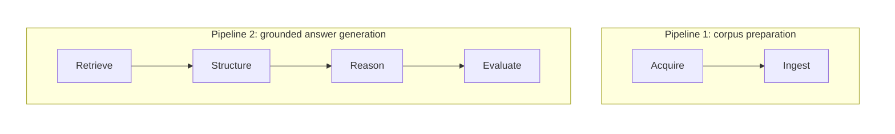

# IFRS Expert

IFRS Expert is a local AI assistant designed to answer real IFRS accounting questions with **grounded, structured, and reproducible reasoning**.

This project explores a practical question:

> How do you make LLM-based systems reliable in a constrained expert domain?

It was **developed in collaboration with an IFRS subject-matter expert**, starting from real questions encountered in practice.

The goal was not just to retrieve relevant standards, but to produce answers that match how experts reason: identifying possible accounting approaches, evaluating their applicability, and providing structured, auditable outputs.

---

## What this project demonstrates

Building LLM systems in practice quickly surfaces non-obvious challenges:

- **Retrieval completeness directly impacts reasoning correctness**  
  Missing sections caused the system to miss an accounting approach entirely (*net investment hedge*).

- **Answers are unstable across question phrasing**  
  The same question expressed differently led to different accounting approaches being identified.

- **Single-pass prompting is unreliable**  
  Asking the model to both identify and evaluate accounting approaches in one step produced inconsistent results.

- **Correctness is not enough**  
  Expert users require answers to cite and justify their reasoning from source material.

This project addresses these issues through:
- automated extraction & ingestion of corpus
- structured retrieval over IFRS standards and practical secondary-source captures
- a two-stage reasoning pipeline with explicit intermediate artifacts
- structured JSON outputs
- a systematic Promptfoo-based evaluation loop to detect regressions and confirm improvements

---

## Example

**Example question**

> Est-ce que je peux appliquer une documentation de couverture dans les comptes consolidés sur la partie change relative aux dividendes intragroupe pour lesquels une créance à recevoir a été comptabilisée ?

**Example output**

- Structured response ([JSON](./experiments/31_new_A_with_less_context_in_B/runs/2026-04-10_17-44-35_promptfoo-eval-family-q1/artifacts/Q1/Q1.0/content-min-score=0.53__expand=0__expand-to-section=true__llm_provider=openai-codex__retrieval-mode=documents/B-response.json)), not visible to user
- Memo-style response ([markdown](./experiments/31_new_A_with_less_context_in_B/runs/2026-04-10_17-44-35_promptfoo-eval-family-q1/artifacts/Q1/Q1.0/content-min-score=0.53__expand=0__expand-to-section=true__llm_provider=openai-codex__retrieval-mode=documents/B-response.md))
- FAQ-style responses ([markdown](./experiments/33_authority_competition_on_full_corpus/runs/2026-04-16_22-20-04_promptfoo-eval-family-q1/artifacts/Q1/Q1.0/llm_provider=openai-codex__policy-config=./effective/policy.default.yaml/B-response_faq.md))

---

## System overview

The system has 2 simple pipelines:



### Key components


- **Acquisition**
  - A Chrome extension downloads all or some documents from the IFRS and Lefebvre Navis websites 
    - For Lefebvre Naxis/Navis, it maps chapters to documents

- **Ingestion**
  - The downloaded documents are ingested:
    - parsed into paragraph-aligned chunks (not arbitrary text windows)
    - embedding each paragraph and storing it in an FAISS index
  - The document structure (sections, hierarchy) is preserved with stable synthetic section ids and reused at retrieval time

- **Retrieval**
  - Semantic retrieval implemented by using cosine similarity over normalized embeddings (`BAAI/bge-m3`) using FAISS
  - `bge-m3` was chosen because 
    1. it is multilingual (IFRS is in English while Navis is in French)
    2. it supports 8192 tokens so we can give it whole paragraphs of texts
    3. it maximized the score distance between non-sensical questions and actual accounting questions when tested initially
  - retrieval is hierarchical:
    1. **document-level retrieval** acts as document routing: which document should we search for the question asked (coarse filtering)
        - document-first retrieval narrows the corpus before chunk search
        - variant-aware document routing (for example IFRS-S / IFRS-BC / IFRS-IE / IFRS-IG, IAS-S, IFRIC, SIC, NAVIS, PS) with different thresholds, caps, and section-expansion rules loaded from YAML policy files
        - avoids global top-k competition across heterogeneous documents and reduces false competition between authoritative standards and ancillary variants
    2. **chunk retrieval** (fine-grained passages) : for each document selected, which chunks are most semantically similar to the question
    3. **chunk expansion** : section expansion allows retrieving entire logical sections instead of isolated chunks, giving consistent context to the LLM

- **Structuring**
  - In the first stage of the LLM pipeline, Prompt A has the LLM do a structured analysis of the input context and identify candidate accounting approaches. It returns a JSON [(example)](../../experiments/31_new_A_with_less_context_in_B/runs/2026-04-10_17-44-35_promptfoo-eval-family-q1/artifacts/Q1/Q1.0/content-min-score=0.53__expand=0__expand-to-section=true__llm_provider=openai-codex__retrieval-mode=documents/A-response.json) with:
      - primary accounting issue
      - authority classification (primary / supporting / peripheral)
      - authority competition handling (IFRS>IAS, IFRIC>SIC, standard>everything)
      - candidate approaches
      - or, a clarification payload (`status = needs_clarification`, `questions_fr`)

- **Reasoning**
  - In the seccond stage, Prompt B has the LLM evaluate applicability based on the pruned context & approaches and return the final answer artifact with assumptions, recommendation, approach-by-approach applicability, and verbatim references
      - Prompt B only receives **primary and supporting authority**, reducing noise and contradictions
  - the same Prompt B JSON is then rendered into two markdown views:
     - a memo-style answer (`B-response.md`)
     - a FAQ-style answer (`B-response_faq.md`)

- **CLI**
  - All features are made available via a [CLI](../../src/cli.py)

- **Web UI**
  - A simple demonstration chat UI is available
  - Supports follow-up questions

- **Evaluation loop**
  - Promptfoo-based regression tests
  - schema validation
  - approach coverage checks
  - recommendation consistency checks

---

## Key design decisions

### Two-stage reasoning with explicit intermediate artifact
Separating:
1. *What are the possible approaches?*
2. *Which one applies here?*

→ significantly improved stability across question variants
- stabilizes approach identification
- makes reasoning auditable
- enables context filtering for Prompt B

---

### Retrieval strategy is a first-class problem
Retrieval evolved from simple chunk search to a **multi-stage, document-aware pipeline**:

- document-level filtering reduces noise early
- per-document-type thresholds avoid cross-document interference
- section expansion improves completeness

→ retrieval quality directly determines which accounting reasoning paths are even available to the model

---

### Authority classification and competition handling improves reasoning quality
Explicitly separating:
- primary authority (governing)
- supporting authority (clarifying / alternative models)
- peripheral authority (ignored for approach identification)

→ prevents irrelevant context from influencing the set of candidate approaches  
→ enables Prompt B to operate on a much cleaner context


Handling overlapping documents correctly 
→ ensures the right standard is used to produce the answer (ex: IFRS 9 rather than IAS 39)
→ reduces noise by narrowing the context

---

### Structured outputs enable evaluation
Outputting JSON makes it possible to:
- validate outputs programmatically
- assert presence of key approaches
- detect regressions across experiments
- compare runs systematically

---

## Evaluation with Promptfoo

Promptfoo is the ongoing regression harness for structured-answer quality.

Typical usage:

```bash
make eval EXPERIMENT_DIR=promptfoo_regression
```

Promptfoo now passes a single `policy-config` path into the answer runner; retrieval tuning lives in `config/policy.default.yaml` (copied into each run's `effective/` directory) rather than being spread across inline provider knobs. Archived runs preserve Prompt A/B inputs plus JSON, memo-style markdown, and FAQ-style markdown outputs.

All artifacts are preserved and the Promptfoo UI can be launched to view the results of any evaluation.

Promptfoo details, commands, storage layout, and archive conventions are documented in:
- [`docs/PROMPTFOO.md`](./docs/PROMPTFOO.md)

---

## Demo

This section sets up a quick demo with only 2 documents (IFRS-9 & IFRIC-16).

### Set up
The assistant supports `openai`, `openai-codex`, `anthropic`, `mistral`, `minimax`, and `ollama` as LLM providers. Configure the provider in your environment or in the `.env` file (see `.env.example`).

Example using Mistral:

```bash
export LLM_PROVIDER=mistral
export MISTRAL_API_KEY=xxx
```

Example using OpenAI Codex OAuth:

```bash
codex login
export LLM_PROVIDER=openai-codex
export OPENAI_CODEX_MODEL=gpt-5.4
# optional override if you do not use ~/.codex/auth.json
# export CODEX_AUTH_FILE=/path/to/auth.json
```

Example using local Ollama via its OpenAI-compatible API:

```bash
export LLM_PROVIDER=ollama
export OLLAMA_MODEL=llama3.2
# optional overrides
# export OLLAMA_BASE_URL=http://localhost:11434/v1
# export OLLAMA_API_KEY=ollama
```

Run the full demo flow end-to-end with the following
```bash
make demo
```
or go through it line by line by following the instructions.

### Ingest documents

#### Storing the 4 provided documents
This is enough for the demo

```bash
uv sync --all-groups

uv run python -m src.cli store examples/www.ifrs.org__issued-standards__list-of-standards__ifric-16-hedges-of-a-net-investment-in-a-foreign-operation.html__content__dam__ifrs__publications__html-standards__english__2026__issued__ifric16.html --doc-uid ifric16
uv run python -m src.cli store examples/www.ifrs.org__issued-standards__list-of-standards__ifrs-9-financial-instruments.html__content__dam__ifrs__publications__html-standards__english__2026__issued__ifrs9.html  --doc-uid ifrs9

uv run python -m src.cli store examples/Lefebvre-Naxis/20260412T190013Z--document.html
uv run python -m src.cli store examples/Lefebvre-Naxis/20260412T190029Z--document.html

```

#### Ingesting more documents
If you want to ingest the wider IFRS corpus through the Chrome extension:
- create an account on https://ifrs.org and sign in through Chrome
- install the [chrome extension](./chrome_extension/ifrs-expert-import/) through developer mode
- either:
  - open the [list of standards](https://www.ifrs.org/issued-standards/list-of-standards/) to batch-capture all selectable variants of all available standards, 
  - or a standard's page to capture all selectable variants for that standard
- click on the extension's icon; this opens a side panel with live progress and saves one HTML + JSON pair per captured variant (Standard, Basis for Conclusions, Implementation Guidance, Illustrative Examples, when available)

   

- run the ingestion `uv run python -m src.cli ingest --scope all`

   `ingest` scans `~/Downloads/ifrs-expert/`, imports every complete HTML + JSON capture pair it finds, and archives each pair to `processed/`, `skipped/`, or `failed/`.

   

#### Ingesting the Lefebvre Naxis files

These files are behind a paywall, so they cannot be distributed as part of the repo. The intended workflow is:

1. log in to Lefebvre on `https://abonnes.efl.fr`
2. install the [chrome extension](./chrome_extension/ifrs-expert-import/) in developer mode
3. open the Navis / Mémento IFRS content page
4. choose one of the two capture modes in the left TOC:
   - **chapter mode**: select a `CHAPITRE` node, then click the extension to capture only that chapter
   - **full corpus mode**: select the corpus root node, then click the extension to crawl the whole corpus; this does **not** create one giant file, it emits **one HTML + JSON pair per chapter**
5. click on the extension's icon; this opens a side panel with live progress and saves one HTML + JSON pair per chapter
6. run the ingestion command: `uv run python -m src.cli ingest --scope all`

   `ingest` scans `~/Downloads/ifrs-expert/`, imports every complete HTML + JSON capture pair it finds, and archives each pair to `processed/`, `skipped/`, or `failed/`.

The extractor derives a `navis-...` document UID from the sidecar metadata and preserves the captured chapter/section hierarchy.

### Quick start using the UI

```bash
uv run streamlit run streamlit_app.py
```
Then copy-paste the following and hit enter
```
Est-ce que je peux appliquer une documentation de couverture dans les comptes consolidés sur la partie change relative aux dividendes intragroupe pour lesquels une créance à recevoir a été comptabilisée ?
```

### Ask a question via the CLI

```bash
echo "Est-ce que je peux appliquer une documentation de couverture dans les comptes consolidés sur la partie change relative aux dividendes intragroupe pour lesquels une créance à recevoir a été comptabilisée ?" \
  | uv run python -m src.cli answer
```

---

## Development process

This project was developed through an iterative, experiment-driven approach with a subject-matter expert.

- See [`docs/METHODOLOGY.md`](docs/METHODOLOGY.md) for the approach used to go from a single question to a prototype assistant
- See [`docs/JOURNAL.md`](docs/JOURNAL.md) for a chronological record of experiments, failures, and improvements

These documents reflect how the system evolved in response to real-world constraints and feedback.

---

## Limitations

- retrieval errors still affect reasoning completeness
- evaluation coverage is still limited (focused on regression, not full benchmarking)
- evaluation precision & recall is not yet implement

---

## Future work

- evaluate on other questions in IFRS 9
- evaluate other types of questions: we expect the prompt to need to be extended here because it is very approach-centric and not all questions are about an approach 
- further improve retrieval completeness and document routing across standards and FAQ-style sources
- refine uncertainty handling in outputs

---

## Summary

This project is an exploration of how to build **reliable LLM systems** by:
- grounding *reasoning* in explicit sources
- structuring intermediate and final outputs
- separating retrieval, approach identification, and applicability
- iterating with real users
- and making behavior testable

The core insight:

> LLM performance is not just a prompting problem —  
> it is a **system design problem**.