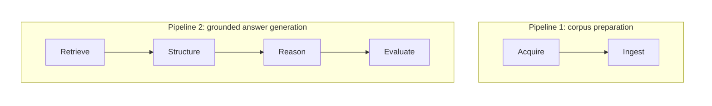
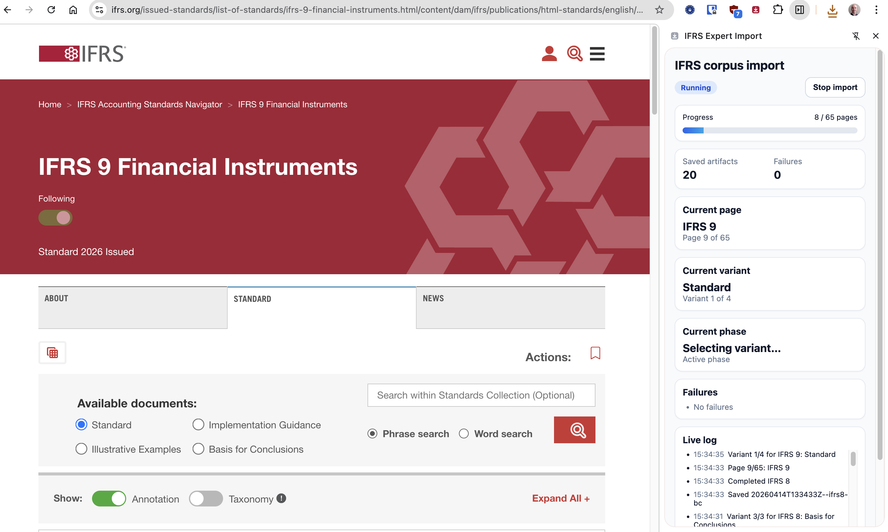
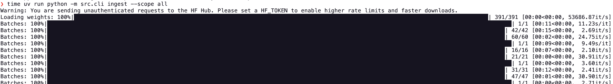

# IFRS Expert

IFRS Expert is a local AI assistant designed to answer real IFRS accounting questions with **grounded, structured, and reproducible reasoning**.

This project explores a practical question:

> How do you make LLM-based systems reliable in a constrained expert domain?

It was **developed in collaboration with an IFRS subject-matter expert**, starting from real questions encountered in practice.

The goal was not just to retrieve relevant standards, but to produce answers that match how experts reason: identifying possible accounting approaches, evaluating their applicability, and providing structured, auditable outputs.

---

## What this project demonstrates

Building LLM systems in practice quickly surfaces non-obvious challenges:

- **Retrieval completeness directly impacts reasoning correctness**  
  Missing sections caused the system to miss an accounting approach entirely (*net investment hedge*).

- **Corpus realism creates authority overlap and routing problems**  
  As the corpus expanded from a small clean subset to a much more realistic IFRS + supporting-materials corpus, overlapping authorities became a first-class systems problem (`IFRS 9` vs `IAS 39`, standards vs basis/implementation material, standards vs FAQ-style secondary sources).

- **Multilingual retrieval is not a solved checkbox**  
  A major recent result was that English retrieval on the Q1 family was nearly perfect while French retrieval was not. That isolated the problem much more clearly: the downstream reasoning stack was not the only issue; French retrieval itself was underperforming.

- **Query normalization helps, but is not enough on its own**  
  Adding a bilingual French→English IFRS glossary improved retrieval of some governing documents, but glossary enrichment alone did not solve the full routing problem and could even push `IFRS 9` down while improving `IFRIC 16` and `IAS 39`.

- **Whole-document similarity is weaker than routing from strong local evidence**  
  A key breakthrough was moving from routing based mainly on broad document representations to routing based on the best chunk match inside a document, then collapsing back to the governing standard.

- **Answers are unstable across question phrasing**  
  The same question expressed differently led to different accounting approaches being identified.

- **Single-pass prompting is unreliable**  
  Asking the model to both identify and evaluate accounting approaches in one step produced inconsistent results.

- **Correctness is not enough**  
  Expert users require answers to cite and justify their reasoning from source material.

This project addresses these issues through:
- automated corpus acquisition and ingestion
- a shared retrieval pipeline with multiple routing modes and experiment-specific policy files
- bilingual query normalization used as a retrieval aid
- a two-stage reasoning pipeline with explicit intermediate artifacts
- structured JSON outputs
- a systematic Promptfoo-based evaluation loop, plus retrieval-specific analysis artifacts, to detect regressions and isolate failure modes

---

## Example

**Example question**

> Est-ce que je peux appliquer une documentation de couverture dans les comptes consolidés sur la partie change relative aux dividendes intragroupe pour lesquels une créance à recevoir a été comptabilisée ?

**Example output**

These three views show the same answer artifact at different levels of structure: machine-readable JSON, a memo-style rendering, and a shorter FAQ-style rendering:
- Structured response ([JSON](./experiments/31_new_A_with_less_context_in_B/runs/2026-04-10_17-44-35_promptfoo-eval-family-q1/artifacts/Q1/Q1.0/content-min-score=0.53__expand=0__expand-to-section=true__llm_provider=openai-codex__retrieval-mode=documents/B-response.json)), not visible to user
- Memo-style response ([markdown](./experiments/31_new_A_with_less_context_in_B/runs/2026-04-10_17-44-35_promptfoo-eval-family-q1/artifacts/Q1/Q1.0/content-min-score=0.53__expand=0__expand-to-section=true__llm_provider=openai-codex__retrieval-mode=documents/B-response.md))
- FAQ-style response ([markdown](./experiments/33_authority_competition_on_full_corpus/runs/2026-04-16_22-20-04_promptfoo-eval-family-q1/artifacts/Q1/Q1.0/llm_provider=openai-codex__policy-config=./effective/policy.default.yaml/B-response_faq.md))

---

## System overview

The system has 2 simple pipelines:



### Key components

- **Acquisition**
  - A Chrome extension downloads all or some documents from the IFRS and Lefebvre Navis websites
    - For Lefebvre Navis, it maps chapters to documents

- **Ingestion**
  - The downloaded documents are ingested:
    - parsed into paragraph-aligned chunks (not arbitrary text windows)
    - embedded and stored in FAISS
  - The document structure (sections, hierarchy) is preserved with stable synthetic section ids and reused at retrieval time
  - In addition to chunk embeddings, ingestion builds document-level representations (`scope`, `objective`, `issue`, `background`, `TOC`, `full`) used by document-routing experiments and the `query-documents` diagnostics workflow

- **Retrieval**
  - Semantic retrieval is implemented by cosine similarity over normalized embeddings (`BAAI/bge-m3`) using FAISS
  - `bge-m3` was chosen because:
    1. it is multilingual (IFRS is primarily in English while Navis questions are in French, the SMEs questions will mainly be in French)
    2. it supports long inputs (8192 tokens) so whole paragraphs and document representations can be embedded
    3. it performed well in initial tests, separating nonsensical queries from actual accounting questions
  - Retrieval is now decomposed into four layers: **Querying**, **Document routing**, **Chunk retrieval**, and **Policy composition**. Each layer has multiple implementations that were added over time for experiments, and the config keeps those options side by side.

    - **Querying**
      - We have raw queries and enriched queries
      - Enriched queries add English IFRS terms when the input is in French
      - The glossary is used only to help retrieval

    - **Document routing**
      - Routing decides which documents are kept after chunk search
      - We have several routing strategies from the experiment history, including return-all, routing through document representations, and routing through chunks
      - The current Q1 setup uses `documents2-through-chunks`, which routes from the strongest chunk-level evidence in each document bundle and then collapses variants back to the governing standard.

    - **Chunk retrieval**
      - Chunk search is tuned separately from document routing
      - We have dense chunk search and title search, each with its own limits and score thresholds
      - Retrieved chunks are expanded to the chunks in the enclosing section before prompting

    - **Policy composition**
      - A retrieval policy is built from smaller reusable parts
      - This keeps the config easier to read and compare across experiments
      - The default config is a catalog of assembled policies, not one large hard-coded block

      ```yaml
      querying:
        enriched:
          embedding_mode: enriched

      document_routing_strategies:
        through_chunks:
          source: top_chunk_results
          profiles:
            q1_authority_family:
              global_d: 5

      chunk_retrieval_strategies:
        dense_chunks:
          mode: chunk_similarity
          profiles:
            default:
              filter:
                min_score: 0.53
                per_document_k: 5

      retrieval_policies:
        standards_only_through_chunks__enriched:
          querying: enriched
          document_routing:
            strategy: through_chunks
            profile: q1_authority_family
            post_processing: main_variant_only
          chunk_retrieval:
            strategy: dense_chunks
            profile: default
      ```


- **Structuring**
  - In the first stage of the LLM pipeline, Prompt A performs a structured analysis of the retrieved context and identifies candidate accounting approaches. It returns a JSON ([example](./experiments/31_new_A_with_less_context_in_B/runs/2026-04-10_17-44-35_promptfoo-eval-family-q1/artifacts/Q1/Q1.0/content-min-score=0.53__expand=0__expand-to-section=true__llm_provider=openai-codex__retrieval-mode=documents/A-response.json)) with:
      - primary accounting issue
      - authority classification (primary / supporting / peripheral)
      - authority competition handling (for example, preferring current governing standards over older or secondary authorities)
      - candidate approaches
      - or, a clarification payload (`status = needs_clarification`, `questions_fr`)

- **Reasoning**
  - In the second stage, Prompt B evaluates applicability based on the pruned context and approaches, then returns the final answer artifact with assumptions, recommendation, approach-by-approach applicability, and verbatim references
      - Prompt B only receives **primary and supporting authority**, reducing noise and contradictions
  - The same Prompt B JSON is then rendered into two markdown views:
     - a memo-style answer (`B-response.md`)
     - a FAQ-style answer (`B-response_faq.md`)

- **CLI**
  - The main workflows are available through a [CLI](./src/cli.py)
  - This includes ingestion, retrieval inspection, document-routing diagnostics, and the two-stage `answer` flow

- **Web UI**
  - A simple demonstration chat UI is available
  - Supports follow-up questions

- **Evaluation loop**
  - Promptfoo-based regression tests for structured-answer quality
  - schema validation
  - approach coverage checks
  - recommendation consistency checks
  - retrieval-specific experiment artifacts such as target matrices, merged delta reports, and similarity tables used to isolate failure modes before changing prompts

---

## Key design decisions

### Two-stage reasoning with explicit intermediate artifact

Separating:
1. *What are the possible approaches?*
2. *Which one applies here?*

→ significantly improved stability across question variants
- stabilizes approach identification
- makes reasoning auditable
- enables context filtering for Prompt B

---

### Retrieval strategy is a first-class problem

Retrieval evolved from simple chunk search to a **multi-stage, document-aware pipeline**, and then further to chunk-first routing back to governing standards.

Key lessons from the recent experiments:

- **Corpus realism introduces authority competition**  
  Early prototypes looked better partly because the corpus was artificially clean. As more IFRS variants and secondary materials were ingested, routing the right governing authority became much harder.

- **The English control isolated the French problem**  
  On the Q1 family, `documents2` retrieval was nearly perfect in English (`Q1en`) while remaining materially weaker in French. That strongly suggested the system had a retrieval-time multilingual matching problem, not just a prompt problem.

- **Glossary enrichment was helpful but insufficient**  
  The bilingual glossary materially improved retrieval for `IFRIC 16` and `IAS 39`, but it did not reliably solve `IFRS 9`. In some cases it made the ranking trade-off worse by shifting score mass toward the other two authorities.

- **Routing from best local evidence was the breakthrough**  
  The shift to `documents2-through-chunks` made routing depend on the best chunk-level match inside a document bundle, then collapse that evidence back to the governing standard. On the Q1 family, this was the first approach that consistently surfaced `IFRS 9`, `IAS 39`, and `IFRIC 16` together near the top.

→ retrieval quality directly determines which accounting reasoning paths are even available to the model

---

### Authority classification and competition handling improves reasoning quality

Explicitly separating:
- primary authority (governing)
- supporting authority (clarifying / alternative models)
- peripheral authority (ignored for approach identification)

→ prevents irrelevant context from influencing the set of candidate approaches  
→ enables Prompt B to operate on a much cleaner context

Handling overlapping documents correctly
→ ensures the right standard is used to produce the answer (for example `IFRS 9` rather than `IAS 39`)
→ reduces noise by narrowing the context

---

### Structured outputs enable evaluation

Outputting JSON makes it possible to:
- validate outputs programmatically
- assert presence of key approaches
- detect regressions across experiments
- compare runs systematically
- keep richer analysis artifacts such as retrieval target matrices and variant-similarity tables

Those artifacts were especially useful in recent work to isolate distinct failure modes:
- ingestion defects
- French vs English retrieval gap
- terminology mismatch
- routing from broad document representations vs routing from strong local evidence

---

## Evaluation with Promptfoo

Promptfoo is the ongoing regression harness for structured-answer quality.

Typical usage:

```bash
make eval EXPERIMENT_DIR=promptfoo_regression
```

Promptfoo now passes a single `policy-config` path into the answer runner; retrieval tuning lives in `config/policy.default.yaml` (copied into each run's `effective/` directory) rather than being spread across inline provider knobs. Archived runs preserve Prompt A/B inputs plus JSON, memo-style markdown, and FAQ-style markdown outputs.

Retrieval work continues to live in experiment directories as first-class artifacts. Recent retrieval experiments also generate richer analysis outputs such as:
- target matrices
- merged delta reports
- similarity tables

This has made it easier to tell apart:
- a bad ingestion artifact
- a French/English semantic mismatch
- a terminology normalization issue
- a routing problem caused by relying on whole-document representations rather than strong chunk-level evidence

All artifacts are preserved and the Promptfoo UI can be launched to view the results of any evaluation.

Promptfoo details, commands, storage layout, and archive conventions are documented in:
- [`docs/PROMPTFOO.md`](./docs/PROMPTFOO.md)

---

## Demo

This section sets up a quick demo with only four documents: `IFRS 9`, `IFRIC 16`, and 2 Lefebvre Navis captures.

### Set up

The assistant supports `openai`, `openai-codex`, `anthropic`, `mistral`, `minimax`, and `ollama` as LLM providers. Configure the provider in your environment or in the `.env` file (see `.env.example`).

Example using Mistral:

```bash
export LLM_PROVIDER=mistral
export MISTRAL_API_KEY=xxx
```

Example using OpenAI Codex OAuth:

```bash
codex login
export LLM_PROVIDER=openai-codex
export OPENAI_CODEX_MODEL=gpt-5.4
# optional override if you do not use ~/.codex/auth.json
# export CODEX_AUTH_FILE=/path/to/auth.json
```

Example using local Ollama via its OpenAI-compatible API:

```bash
export LLM_PROVIDER=ollama
export OLLAMA_MODEL=llama3.2
# optional overrides
# export OLLAMA_BASE_URL=http://localhost:11434/v1
# export OLLAMA_API_KEY=ollama
```

Run the full demo flow end-to-end with the following:

```bash
make demo
```

or go through it line by line by following the instructions.

### Ingest documents

#### Storing the 4 provided documents

This is enough for the demo.

```bash
uv sync --all-groups

uv run python -m src.cli store examples/www.ifrs.org__issued-standards__list-of-standards__ifric-16-hedges-of-a-net-investment-in-a-foreign-operation.html__content__dam__ifrs__publications__html-standards__english__2026__issued__ifric16.html --doc-uid ifric16
uv run python -m src.cli store examples/www.ifrs.org__issued-standards__list-of-standards__ifrs-9-financial-instruments.html__content__dam__ifrs__publications__html-standards__english__2026__issued__ifrs9.html --doc-uid ifrs9

uv run python -m src.cli store examples/Lefebvre-Navis/20260412T190013Z--document.html
uv run python -m src.cli store examples/Lefebvre-Navis/20260412T190029Z--document.html
```

#### Ingesting more documents

If you want to ingest the wider IFRS corpus through the Chrome extension:
- create an account on https://ifrs.org and sign in through Chrome
- install the [chrome extension](./chrome_extension/ifrs-expert-import/) through developer mode
- either:
  - open the [list of standards](https://www.ifrs.org/issued-standards/list-of-standards/) to batch-capture all selectable variants of all available standards,
  - or a standard's page to capture all selectable variants for that standard
- click on the extension's icon; this opens a side panel with live progress and saves one HTML + JSON pair per captured variant (Standard, Basis for Conclusions, Implementation Guidance, Illustrative Examples, when available)

   

- run the ingestion command `uv run python -m src.cli ingest --scope all`

  `ingest` scans `~/Downloads/ifrs-expert/`, imports every complete HTML + JSON capture pair it finds, and archives each pair to `processed/`, `skipped/`, or `failed/`.

   

#### Ingesting the Lefebvre Navis files

These files are behind a paywall, so they cannot be distributed as part of the repo. The intended workflow is:

1. log in to Lefebvre on `https://abonnes.efl.fr`
2. install the [chrome extension](./chrome_extension/ifrs-expert-import/) in developer mode
3. open the Navis / Mémento IFRS content page
4. choose one of the two capture modes in the left TOC:
   - **chapter mode**: select a `CHAPITRE` node, then click the extension to capture only that chapter
   - **full corpus mode**: select the corpus root node, then click the extension to crawl the whole corpus; this does **not** create one giant file, it emits **one HTML + JSON pair per chapter**
5. click on the extension's icon; this opens a side panel with live progress and saves one HTML + JSON pair per chapter
6. run the ingestion command: `uv run python -m src.cli ingest --scope all`

   `ingest` scans `~/Downloads/ifrs-expert/`, imports every complete HTML + JSON capture pair it finds, and archives each pair to `processed/`, `skipped/`, or `failed/`.

The extractor derives a `navis-...` document UID from the sidecar metadata and preserves the captured chapter/section hierarchy.

### Quick start using the UI

```bash
uv run streamlit run streamlit_app.py
```

Then copy-paste the following and hit enter:

```text
Est-ce que je peux appliquer une documentation de couverture dans les comptes consolidés sur la partie change relative aux dividendes intragroupe pour lesquels une créance à recevoir a été comptabilisée ?
```

### Ask a question via the CLI

```bash
echo "Est-ce que je peux appliquer une documentation de couverture dans les comptes consolidés sur la partie change relative aux dividendes intragroupe pour lesquels une créance à recevoir a été comptabilisée ?" \
  | uv run python -m src.cli answer
```

---

## Development process

This project was developed through an iterative, experiment-driven approach with a subject-matter expert.

- See [`docs/METHODOLOGY.md`](./docs/METHODOLOGY.md) for the approach used to go from a single question to a prototype assistant
- See [`docs/JOURNAL.md`](./docs/JOURNAL.md) for a chronological record of experiments, failures, and improvements

The journal is especially useful for understanding how the retrieval work evolved over time:
- first from chunk retrieval to document routing
- then to more realistic full-corpus authority competition
- then to isolating the French vs English retrieval gap
- then to testing glossary enrichment
- and finally to routing through strong local chunk evidence inside documents

These documents reflect how the system evolved in response to real-world constraints and feedback rather than from a single predetermined design.

---

## Limitations

- the strongest current evidence is still on the **Q1 family**; the latest retrieval gains should be read as demonstrated there first, not as a blanket claim of general IFRS coverage
- the bilingual glossary is currently **hand-authored** and used only for retrieval embeddings; it is not yet a general terminology layer for answer generation
- corpus realism still creates hard authority-overlap problems between governing standards, superseded standards, supporting materials, and practitioner commentary
- ingestion quality still matters a lot; several recent retrieval improvements came from finding and fixing ingestion defects rather than from changing prompts
- evaluation coverage is still limited compared with a full benchmark suite; this is a disciplined regression harness, not yet a comprehensive product evaluation framework

---

## Future work

- broaden evaluation beyond the Q1 family and beyond approach-centric hedge-accounting questions
- continue improving French retrieval and routing across more IFRS topics and more varied phrasings
- formalize retrieval metrics further alongside answer metrics
- decide when supporting materials should be re-expanded after standard selection to improve answer quality without reintroducing too much noise
- test whether glossary generation can be automated from IFRS definition/terminology sections with an LLM in a way that is robust enough to be worth keeping; for now this remains a plausible retrieval aid, not a core productized path
- refine uncertainty handling in outputs

---

## Summary

This project is an exploration of how to build **reliable LLM systems** by:
- grounding *reasoning* in explicit sources
- structuring intermediate and final outputs
- separating retrieval, approach identification, and applicability
- iterating with real users
- making behavior testable
- and treating retrieval as an engineering problem in its own right

The core insight remains:

> LLM performance is not just a prompting problem —  
> it is a **system design problem**.

The latest retrieval work sharpened that conclusion:

> In a realistic expert corpus, a large part of the problem is routing the right authority from overlapping evidence, across languages, before the model reasons at all.
