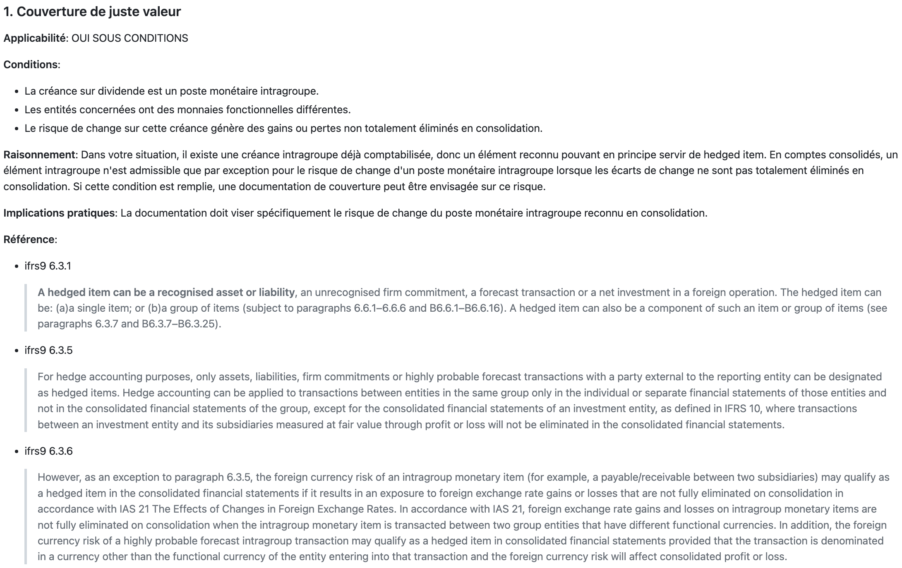
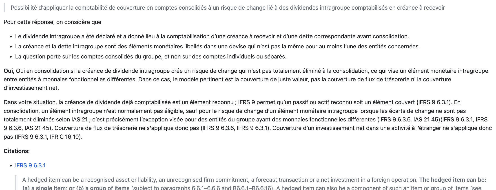
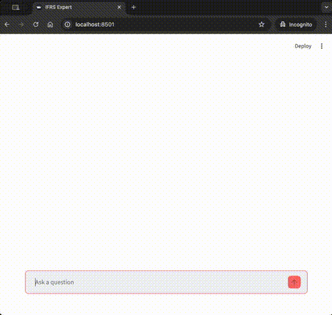
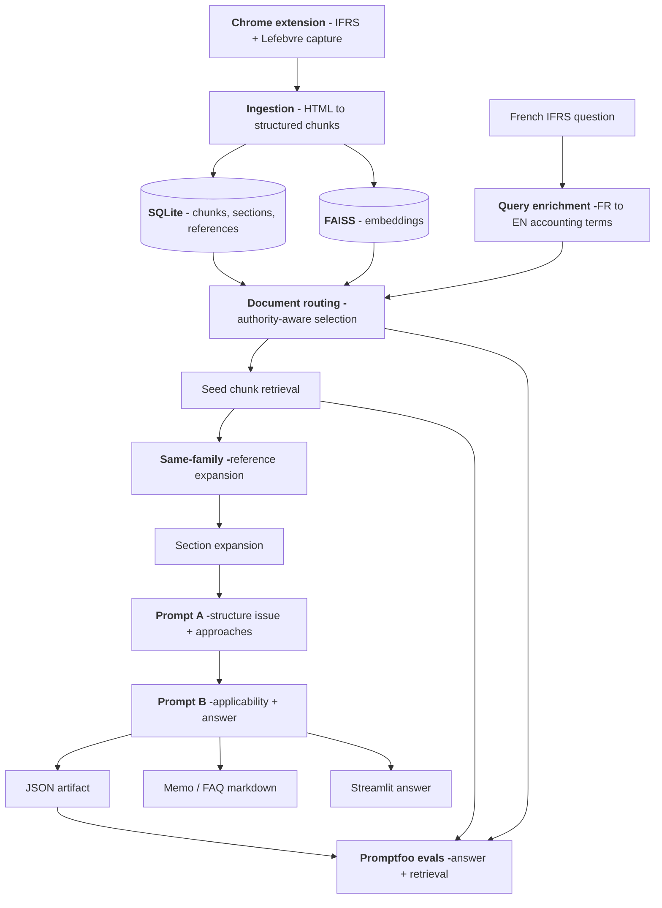
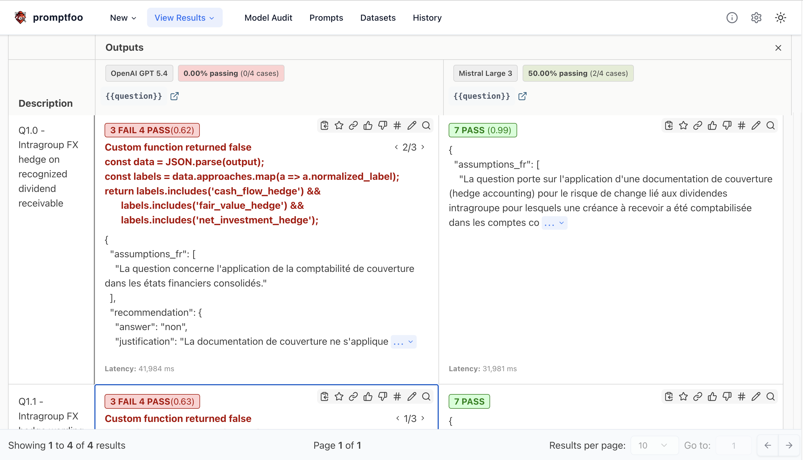
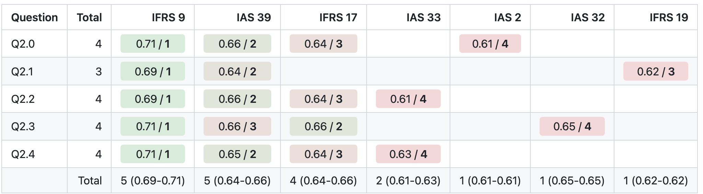
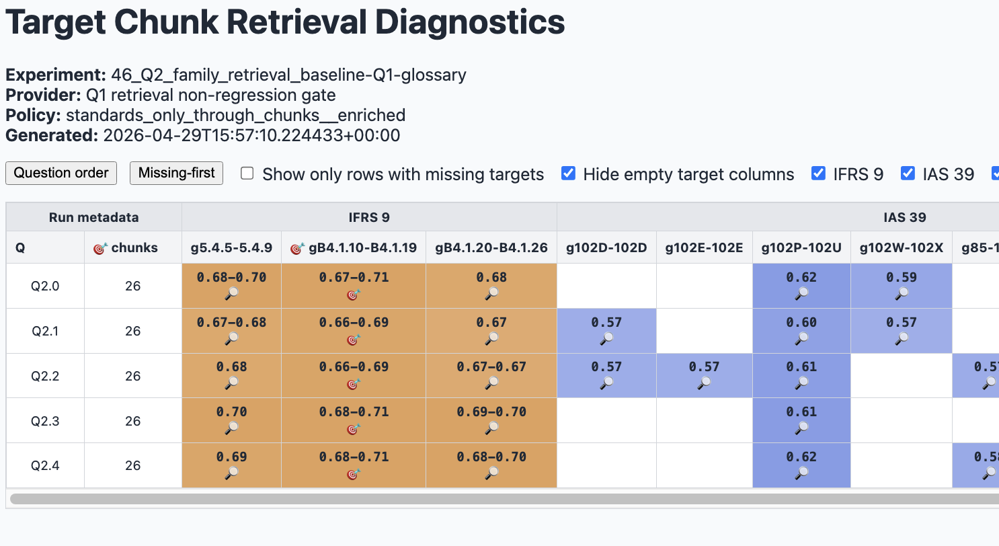
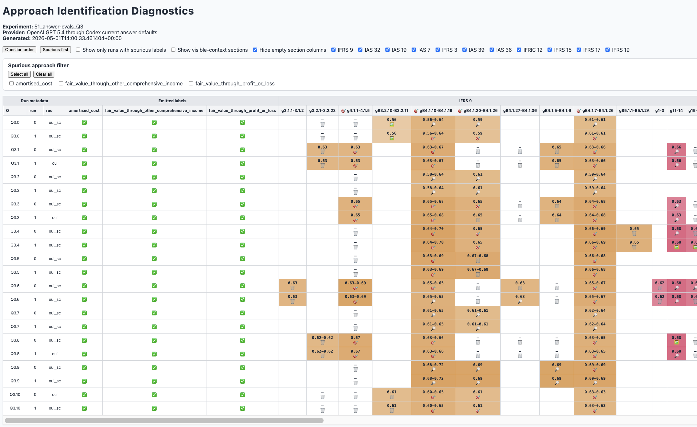

<p align="center">
  
</p>

<p align="center">
  
  
  
  
</p>

<p align="center">
  
  
  
  
</p>
<p align="center">
  <strong>A local AI foundation for IFRS case analysis: private corpus ingestion, authority-aware retrieval, cross-language cited reasoning, and systematic evals.</strong>
</p>

<p align="center"><b>
  <a href="#walkthrough">Walkthrough</a> ·
  <a href="#technical-overview">Technical Overview</a> ·
  <a href="#evaluation-and-diagnostics">Evaluation and diagnostics</a> ·
  <a href="#run-it-yourself">Run It Yourself</a> ·
  <a href="#checkpoint">Checkpoint</a>
  </b>
</p>

IFRS Expert is a local RAG system for IFRS accounting analysis. It focuses on grounded answers: acquiring the relevant corpus, retrieving the governing authority, separating primary material from background material, reasoning against the facts, and citing the sources used.

“Local” refers to corpus storage, ingestion, retrieval, and evaluation artifacts. The LLM backend is configurable and can use hosted providers or local Ollama models.

The project was built with an IFRS subject-matter expert (SME), starting from a real question encountered in practice. It handles a mixed French/English corpus, accepts questions in French and English, retrieves across languages, and produces cited answers in French.

Discussions with the SME during progress reviews surfaced that the expert workflow is often less about finding the right paragraph in a standard and more about collecting, reading, and reconciling company-specific evidence with authoritative guidance.

That makes the long-term target a case-analysis workflow: accounting sources plus the evidence package the expert builds for a case-specific judgment. The current project is therefore best understood as the evidence and reasoning foundation for that larger workflow.


## Why not just prompt a frontier model?

Frontier models with public search are already useful. The gap here is evidence access and auditability: expert accounting answers often depend on paywalled, private, or company-specific material such as supporting IFRS documentation, IFRS annotations and firms' interpretations.

This project builds the layer needed to reason over those sources.

## Current scope

The current architecture works best when the question depends on choosing between peer accounting models, treatments, recognition bases, measurement categories, or exemptions. Examples include:

- IFRS 9 hedge-accounting questions;
- IFRS 15 licence revenue timing;
- IFRS 16 short-term lease exemptions;
- IAS 37 provision / contingent-liability threshold questions where the standard exposes stable answer categories.

It is not a fully general IFRS reasoning architecture. The latest wording-variant stress test found a clear boundary: the current schema works best when the answer can be framed as selecting or comparing accounting treatments.

Some questions need a different structure. IFRS 10 control questions are better handled as a control-assessment framework with criteria and indicators. IFRS 13 default-risk questions are better handled as fair-value measurement assessments, not as lists of peer approaches.

Supporting those cleanly would require classifying the question type first, then using an intermediate schema tailored to that type of analysis.

## Walkthrough
### Corpus preparation (once)
The corpus is acquired once via a Chrome browser plugin
<p align="center">
  <a href="docs/images/IFRS-ingestion.png" target="blank">
    
  </a>
</p>

Then it is loaded into the system's knowledge base (via a CLI, for now). The knowledge base supports French and English.
<p align="center">
  <a href="docs/images/Ingest-Screenshot.png" target="blank">
    
  </a>
</p>
From there, the corpus becomes available for reasoning. 

### Reasoning over the corpus

The user asks a question, in French or English.

> Est-ce que je peux appliquer une documentation de couverture dans les comptes consolidés sur la partie change relative aux dividendes intragroupe pour lesquels une créance à recevoir a été comptabilisée ?

The retrieval pipeline searches across the French/English corpus and returns relevant chunks from the most relevant documents, regardless of the language of the question or source.

>- IFRS 9 hedge-accounting paragraphs
>- IFRIC 16 net-investment hedge guidance
>- IAS 39 hedge-accounting paragraphs

The first LLM call classifies the retrieved material and determines which documents are governing authority.

>- IAS 39 is excluded because IFRS 9 supersedes it

Then it identifies the top-level approaches supported by the remaining authority and records the relevant citations.

>- cash flow hedge
>- fair value hedge
>- hedge of a net investment

Finally, the second LLM call reasons over each approach using the facts provided in the question to determine applicability.

>- cash flow hedge: not applicable
>- fair value hedge: applicable
>- hedge of a net investment: not applicable

The output is a structured response containing the reasoning over each approach: conditions, applicability, reasoning, practical implications and citations. It is used for evaluation, diagnostics, and downstream rendering.

>- Structured response ([JSON](./experiments/31_new_A_with_less_context_in_B/runs/2026-04-10_17-44-35_promptfoo-eval-family-q1/artifacts/Q1/Q1.0/content-min-score=0.53__expand=0__expand-to-section=true__llm_provider=openai-codex__retrieval-mode=documents/B-response.json))

The markdown views are for users.

<div align="center">
  <div style="display: flex; justify-content: center; gap: 16px; flex-wrap: wrap;">
    <div align="center">
      <a href="./experiments/31_new_A_with_less_context_in_B/runs/2026-04-10_17-44-35_promptfoo-eval-family-q1/artifacts/Q1/Q1.0/content-min-score=0.53__expand=0__expand-to-section=true__llm_provider=openai-codex__retrieval-mode=documents/B-response.md" target="blank">
        <br/>
        <b>Memo-style IFRS answer with citations</b>
      </a>
    </div>
    <div align="center">
      <a href="./experiments/33_authority_competition_on_full_corpus/runs/2026-04-16_22-20-04_promptfoo-eval-family-q1/artifacts/Q1/Q1.0/llm_provider=openai-codex__policy-config=./effective/policy.default.yaml/B-response_faq.md" target="blank">
        <br/>
        <b>FAQ-style IFRS answer with citations</b>
      </a>
    </div>
  </div>
</div>

### Client-facing UI

The UI shows the user-facing answer, while the pipeline also saves structured JSON, prompt inputs, retrieved context, and evaluation artifacts for inspection.

<p align="center">
  <a href="docs/images/IFRS-demo.mp4" target="blank">
    
  </a>
</p>

## Performance snapshot

| Question Family | Topic | Retrieval | Answer result | SME evaluation | Notes |
|---|---|:---:|:---:|:---:|:---:|
| Q1 | Hedge accounting | 100% docs/chunks | Pass | Pass | Original SME question family |
| Q2 | IFRS 9 SPPI / classification | 100% docs/chunks | Pass | Pass | Approach labels stabilized |
| Q3 | SPPI definition | 100% docs/chunks | Pass | Pass | Cross-reference expansion helped |
| Q5 | Fair value risk | 5⁄5 docs, 4⁄5 variants with all chunks | Boundary identified | Pass | Measurement question, not approach selection |
| Q6 | Control assessment | 100% docs/chunks | Boundary identified | Pass | Criteria-based control assessment |
| Q9 | IP licence revenue timing | 100% docs/chunks | Pass | Pass | Clean approach-selection case; label drift remains |
| Q12 | Short-term lease exemption | 5⁄5 docs, 3⁄5 variants with all chunks | Works with caveats | Pass | Approach labels and question polarity need eval refinement |
| Q16 | Carbon neutrality provision | 4⁄4 docs, 3⁄4 variants with all chunks | Pass | Pass | Stable labels, correct answer referencing IFRIC Decision |

“SME evaluation” reflects review of the generated answer direction and usefulness, not a full production acceptance test.

<details>
<summary><b>More details on the latest checkpoint</b></summary>

The latest generalization work stress-tested wording variants for Q5, Q6, Q9, Q12, and Q16. Q9 is the cleanest success for the current architecture. Q12 is a qualified success that exposed label and polarity-evaluation issues. Q16 is promising but needs SME review on the expected applicability contract.

Q5 and Q6 exposed the main architecture boundary: they are better understood as measurement / criteria-based assessment questions than as peer approach-selection questions.

> The current system generalizes best to IFRS questions that require selecting or comparing accounting treatments. It is not yet designed as a fully general IFRS reasoning architecture for single-framework assessment questions.
</details>
<br>

## Technical Overview
### Architecture

The core engineering question is 
>How do you make an LLM-based system reliable in a constrained expert domain with overlapping authorities, multilingual questions, private source material, and evidence-sensitive reasoning?

The answer is an evidence-first RAG architecture: structured corpus acquisition, authority-aware retrieval, reference expansion, a two-stage LLM pipeline, and structured outputs that can be evaluated.



### Technical challenges

The failures were not just bad answers. They happened at different layers of the system, and the fix was not always “better prompting.” It required:
- authority-aware routing,
- chunk-first document selection,
- bilingual query enrichment,
- same-family reference expansion,
- retrieval-only regression tests.

Some examples:
| Failure                                   | Root cause                      | Fix                                   |
| ----------------------------------------- | ------------------------------- | ------------------------------------- |
| Missing net investment hedge              | Target paragraphs not retrieved | chunk + section expansion             |
| IAS 39 selected over IFRS 9               | authority overlap               | authority resolution + better routing |
| French query missed IFRS 9                | multilingual mismatch           | glossary enrichment                   |
| B4.1 guidance retrieved but not 4.1 rules | internal references ignored     | same-family reference expansion       |

### Key engineering lessons

> The main lesson: in expert-domain RAG, the hard part is not only getting the LLM to reason. It is making sure the right authority reaches the model in the first place.

- evidence completeness determines reasoning correctness
- authority routing matters in realistic corpora
- multilingual retrieval needed explicit handling
- structured evals made failures diagnosable

### More details
For more details, see [ARCHITECTURE.md](./docs/ARCHITECTURE.md) and [ENGINEERING_NOTES.md](./docs/ENGINEERING_NOTES.md)

## Evaluation and diagnostics

### Quality gating with PromptFoo
Promptfoo is the main regression harness for the Prompt A -> Prompt B answer pipeline. The harness checks not only whether the answer looks right, but whether the expected documents and paragraphs were present before the LLM reasoned.

<p align="center">
  <a href="docs/images/PromptFoo-run.png" target="blank">
    
  <br/><b>Example failed run from early experiments</b>
  </a>
</p>


### Layer-specific diagnostics

Diagnostics scripts live under `experiments/analysis/` and include document routing, target chunk retrieval and approach detection.

Each layer follows the same pattern:

- generate run-level JSON / Markdown / HTML artifacts;
- compare saved runs;
- append reproducible summaries to experiment write-ups.

<div align="center">
  <div style="display: flex; justify-content: center; gap: 16px; flex-wrap: wrap;">
    <div align="center">
      <a href="docs/images/retrieval-debugging-documents.png" target="blank">
        <br/>
        <b>Document retrieval analysis</b>
      </a>
    </div>
    <div align="center">
      <a href="docs/images/retrieval-debugging-chunks.png" target="blank">
        <br/>
        <b>Chunk retrieval analysis</b>
      </a>
    </div>
    <div align="center">
      <a href="docs/images/retrieval-debugging-approaches.png" target="blank">
        <br/>
        <b>Approach detection analysis</b>
      </a>
    </div>
  </div>
</div>

### More details

More Promptfoo details are documented in [`docs/PROMPTFOO.md`](./docs/PROMPTFOO.md).

## Repository map

- `src/` — CLI, ingestion, retrieval, and answer pipeline
- `chrome_extension/` — corpus acquisition extension
- `experiments/` — question families, runs, diagnostics, and experiment write-ups
- `docs/` — methodology, journal, engineering notes, Promptfoo documentation
- `config/` — retrieval policy and glossary configuration

## Run it yourself

This demo uses four documents: `IFRS 9`, `IFRIC 16` and two Lefebvre Navis captures.

### Setup

The assistant supports several LLM providers: `openai`, `openai-codex`, `anthropic`, `mistral`, `minimax` and `ollama` for local LLMs.

Configure the provider in your environment or in `.env` (see `.env.example`).

Example using OpenAI Codex :

```bash
codex login
export LLM_PROVIDER=openai-codex
export OPENAI_CODEX_MODEL=gpt-5.4
```

### Run the demo

The simplest way to run the demo is to:

```bash
make demo
```

<details>
<summary>If you want to run it manually and test the Chrome extension</summary>

#### Store the demo documents

```bash
uv sync --all-groups

uv run python -m src.cli store examples/www.ifrs.org__issued-standards__list-of-standards__ifric-16-hedges-of-a-net-investment-in-a-foreign-operation.html__content__dam__ifrs__publications__html-standards__english__2026__issued__ifric16.html --doc-uid ifric16
uv run python -m src.cli store examples/www.ifrs.org__issued-standards__list-of-standards__ifrs-9-financial-instruments.html__content__dam__ifrs__publications__html-standards__english__2026__issued__ifrs9.html --doc-uid ifrs9

uv run python -m src.cli store examples/Lefebvre-Navis/20260412T190013Z--document.html
uv run python -m src.cli store examples/Lefebvre-Navis/20260412T190029Z--document.html
```

#### Ingest more IFRS documents

To ingest the wider IFRS corpus:

1. create an account on `https://ifrs.org` and sign in through Chrome;
2. install the [Chrome extension](./chrome_extension/ifrs-expert-import/) in developer mode;
3. open either the IFRS list of standards page or an individual standard page;
4. click the extension icon to capture the available variants;
5. run:

```bash
uv run python -m src.cli ingest --scope all
```

The ingestion command scans `~/Downloads/ifrs-expert/`, imports complete HTML + JSON capture pairs, and archives each pair to `processed/`, `skipped`, or `failed`.

#### Ingest Lefebvre Navis

Lefebvre Navis content is behind a paywall and is not distributed in this repository.

Workflow:

1. log in to `https://abonnes.efl.fr`;
2. install the [Chrome extension](./chrome_extension/ifrs-expert-import/) in developer mode;
3. open the Navis / Mémento IFRS content page;
4. choose chapter mode or full corpus mode;
5. click the extension icon to capture one HTML + JSON pair per chapter;
6. run:

```bash
uv run python -m src.cli ingest --scope all
```

The extractor derives a `navis-...` document UID from sidecar metadata and preserves the captured chapter / section hierarchy.

#### Quick start using the UI

```bash
uv run streamlit run streamlit_app.py
```

Then paste:

```text
Est-ce que je peux appliquer une documentation de couverture dans les comptes consolidés sur la partie change relative aux dividendes intragroupe pour lesquels une créance à recevoir a été comptabilisée ?
```

#### Ask a question via the CLI

```bash
echo "Est-ce que je peux appliquer une documentation de couverture dans les comptes consolidés sur la partie change relative aux dividendes intragroupe pour lesquels une créance à recevoir a été comptabilisée ?" \
  | uv run python -m src.cli answer --policy-config config/policy.default.yaml --retrieval-policy standards_only_through_chunks__enriched
```

</details>

## Development process

This project was developed through iterative experiments with a subject-matter expert.

Related docs:

- [`docs/METHODOLOGY.md`](./docs/METHODOLOGY.md) describes the planned methodology ;
- [`docs/JOURNAL.md`](./docs/JOURNAL.md) records the chronological development process;
- [`docs/ENGINEERING_NOTES.md`](./docs/ENGINEERING_NOTES.md) extracts the reusable lessons;

The journal preserves the actual sequence of experiments, failures, bug fixes, and design changes. The engineering notes are the shorter synthesis.

## Checkpoint

### What the current project demonstrates

- realistic corpus acquisition;
- structured ingestion;
- document-aware retrieval;
- multilingual query enrichment;
- cross-reference expansion;
- two-stage LLM reasoning;
- authority classification;
- Promptfoo regression testing;
- layer-specific diagnostics;
- a clear empirical boundary for the architecture.


### Limitations

- The system is not a general IFRS oracle.
- It works best for questions that can be framed as approach / treatment selection. It is weaker on single-framework assessment questions unless the standard exposes stable answer categories.
- Some approach labels still need code-side canonicalization for evaluation stability.
- Some target paragraphs are bridge paragraphs that can be missed even when the governing document is retrieved.
- The bilingual glossary is still partly hand-tuned and used only for retrieval, it was not expanded beyond the needs of the Q1 family so it may not be needed in most cases. 
- The evaluation harness is a regression system, not a comprehensive IFRS benchmark.

## Future work

1. Expanding the kinds of questions that are supported by classifying the question type before choosing the intermediate reasoning schema, so approach-selection, measurement, recognition-threshold, eligibility, and control-assessment questions can use different structures.

2. Expand scope to user's wider workflow by reasoning on the entire case file.
    - company-evidence ingestion: process contracts, internal memos, org charts, policies, and other documents collected during an accounting analysis;
    - mixed evidence reasoning: reason jointly over company-specific facts, standards, and interpretative guidance while keeping their roles separate;
    - fact extraction and evidence requests: identify missing facts needed for an accounting conclusion and generate targeted questions for stakeholders;
    - case-file workflow: support iterative collection of documents, notes, assumptions, and conclusions for a specific accounting issue.

3. Productization work, including:
    - observability and retrieval provenance across the full pipeline;
    - model/version regression tests across archived question families;
    - evaluation dataset governance, including versioned expected outputs, SME approvals, and known caveats;
    - corpus versioning and freshness checks, so answers can be tied back to a specific source snapshot;
    - citation-support checks, not only citation presence checks;
    - cost and latency measurement by pipeline stage;
    - stronger context pruning, caching, and prompt-size control;
    - SME feedback capture that turns reviewed answers into a golden dataset;
    - evaluate whether a specialized orchestration framework would simplify the implementation and improve observability
    - follow-up handling that decides whether to reuse prior context, retrieve additional evidence, or treat the message as a new accounting issue;