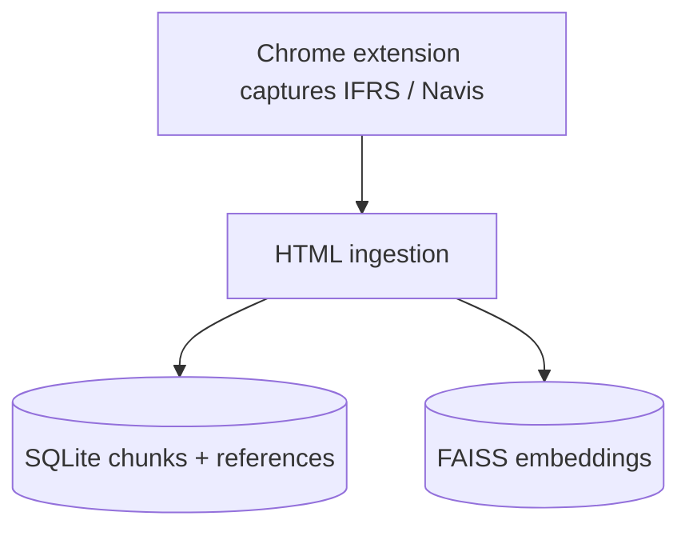
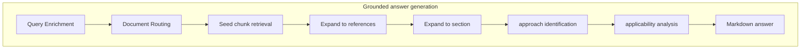

# Architecture

The architecture is fairly standard and grew organically as the project unfolded. It was intentionaly not a [Big Design Up Front](https://en.wikipedia.org/wiki/Big_design_up_front) in order to demonstrate feasibility first and foremost.

The various layers and components are, however, clearly visible and can be substituted for more robust alternatives in particular FAISS (a vector database) and the overall pipeline (LangChain). This would make sense for the productization phase because the subsitutions would be rather easy and agents would be able to do it.

The system has two main pipelines:
1. corpus preparation
2. grounded answer generation

---

## 1. Corpus preparation

The end-user directly acquires the corpus.



### Acquisition

A Chrome extension captures source documents from:

- IFRS;
- Lefebvre Navis.

For IFRS, the extension can capture standards and related materials such as basis material, implementation guidance, illustrative examples, and annotations.

For Lefebvre Navis, it maps chapters to documents so the corpus is not ingested as one giant blob.

### Ingestion

The ingestion layer:

- parses HTML captures;
- preserves document hierarchy;
- creates stable synthetic section ids;
- creates paragraph-aligned chunks instead of arbitrary text windows;
- stores text in SQLite;
- stores embeddings in FAISS;
- builds document-level representations for routing experiments;
- parses and stores same-document-family cross-references from IFRS `Refer:` annotations and internal links.

This layer matters because several retrieval failures were caused by ingestion defects, not model behavior.

---

## 2. Grounded answer generation




The current embedding model is `BAAI/bge-m3`. It was chosen because it is multilingual, supports long inputs, and performed well in initial accounting-retrieval tests.

The answer generation pipeline is split into reusable layers:

1. document routing;
2. seed chunk retrieval;
3. same-family reference expansion;
4. section expansion;

### Query enrichment

User queries can be raw or enriched with English IFRS terms when the input is French.

The bilingual glossary is used only to improve retrieval.

### Document routing

Document routing decides which documents survive into chunk retrieval and prompting.

The project includes several routing strategies:

- route through document-level representations;
- route through chunk-level evidence;
- standards-only routing from chunk evidence.

The strongest current path routes from local chunk-level evidence and keeps the governing standard.

### Seed chunk retrieval

Seed chunks are retrieved inside the routed documents via dense retrieval using cosine similarity over normalized embeddings with FAISS.

Dense chunk retrieval is tuned separately from document routing. Title-based retrieval was also developed for experiments and diagnostics.

### Same-family reference expansion

After seed chunk retrieval, the system can follow stored references within the same document family.

This recovers governing paragraphs that are explicitly referenced by retrieved explanatory or application-guidance chunks.

### Section expansion

After seed retrieval and reference expansion, the system expands locally to the enclosing section where appropriate.

This gives the reasoning stage enough context without blindly injecting whole documents.

## Retrieval policy composition

Retrieval policies are assembled from reusable components, which makes changes easier to compare across experiments.

Example shape ([full example](./config/policy.default.yaml))

```yaml
querying:
  enriched:
    embedding_mode: enriched

document_routing_strategies:
  through_chunks:
    source: top_chunk_results
    profiles:
      compact:
        global_d: 5

chunk_retrieval_strategies:
  dense_chunks:
    mode: chunk_similarity
    profiles:
      default:
        filter:
          min_score: 0.53
          per_document_k: 10

retrieval_policies:
  standards_only_through_chunks__enriched:
    querying: enriched
    document_routing:
      strategy: through_chunks
      profile: compact
      post_processing: main_variant_only
    chunk_retrieval:
      strategy: dense_chunks
      profile: default
```

---

## Reasoning pipeline

The LLM pipeline has two stages.

## approach identification: structure the accounting problem

approach identification does not write the final answer.

It returns structured JSON containing:

- the primary accounting issue;
- authority classification:
  - primary authority;
  - supporting authority;
  - peripheral authority;
- authority-competition handling;
- treatment families;
- candidate peer accounting approaches;
- a clarification payload if the context is insufficient.

Its job is to stabilize the set of accounting approaches before applicability is considered.

## applicability analysis: evaluate applicability and answer

applicability analysis receives:

- the user question;
- approach identification's structured output;
- a pruned context containing primary and supporting authority.

It returns a final structured answer with:

- assumptions;
- recommendation;
- approach-by-approach applicability;
- practical implications;
- source references.

The same JSON artifact can be rendered into memo-style or FAQ-style markdown.