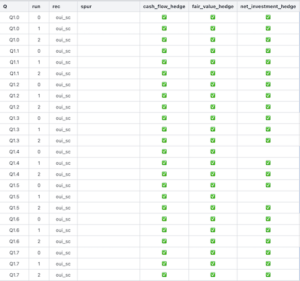

# Project Journal - IFRS Expert Assistant

This journal captures the actual development process of the IFRS Expert assistant.

It documents how the system evolved from a single prompt to a structured, evaluated pipeline, including key failures, experiments, and design decisions.

---

## Discovery

### 2026-03-19 : Validate that a prompt can find the right answer to a real question based on grounding standards excerpts

- Worked from a real question fielded by the Subject-Matter Expert where multiple accounting approaches need to be evaluated (answer in IFRS 9 + IFRIC 16). Manually retrieved relevant sections of IFRS 9
- Built prompt constraining LLM to answer based only on sections provided and cite relevant sections
- Iterated on prompt & sections included until SME confirmed response correctness
- iterated on structure and tone until SME signed off
    - uncovered new uses of the tool ("copy-paste summary recommendation", "widen analysis to evaluate multiple approaches")

### 2026-03-20 : PDF Parsing & Chunking prototype

- Implemented PDF parsing for IFRS 16 and IFRS 9 standards, chunking by document section rather than character count
    - Prepare test document & test fixture
    - Implementation
- Built CLI commands to store and list document chunks, integrating SQLite for text storage and FAISS for vector indexing.

### 2026-03-20 : Similarity-based retrieval prototype

- Implement cosine similarity on normalized vectors, test on various queries including non-sensical
- Switch to BGE-M3 embeddings to better separate scores for relevant and non-relevant queries
- Added JSON output option
- Created a cheap retrieval test harness
- Test "discovery" prompt that worked with SME on the chunks retrieved: works ok

### 2026-03-24 : Tune retrieval and prompt until answer is as good as first acceptable answer

- Added chunk size limits to prevent errors on oversized chunks due to imperfect parsing of PDF
- Added `e`= chunk expansion around a retrieved chunk
- Implement `answer` on the CLI so it generates the prompt automatically
- Add option to expand to all the chunks of a document when document is under threshold size (to include all of IFRIC-16)
- Tune until "Net Investment Hedge" approach is surfaced
    - [Experiment 01](../experiments/01_min_context_size/EXPERIMENTS.md): manual experiment on (k, e, f) to evaluate how much context is necessary to surface "Net Investment Hedge" approach
    - [Experiment 02](../experiments/02_proper_context_hierarchical_retrieval/EXPERIMENTS.md): create 3 variations of the SME's question, experiment on a minimum score threshold to consider a retrieved chunk combined with retriving top-k *per document* and structuring chunks per document in the prompt

### 2026-03-24 - 2026-03-25: Tune until answer is stable across wording variants of the question

- Create 20 variations of the SME's question and quick & dirty automation calling the LLM with Pi to streamline testing
- [Experiment 03](../experiments/03_proper_context_hierarchical_retrieval/EXPERIMENTS.md) : fix (k=5, e=5, min-score=0.5, f= 0) and evaluate stability of answers to each question variant qualitatively

- Address answer variance by introducing **2-stage pipeline**: 
    - Prompt A identifies legitimate accounting approaches
    - Prompt B determines applicability to the context
- Refine prompts through many experiments while developping quantitative analysis
    - [Experiment 04](../experiments/04_2_stage_processing/EXPERIMENTS.md) computes 3 runs of the 2-stage pipeline on the 22 questions, first attempt at quantitative analysis
    - [Experiment 05](../experiments/05_tighter_2_stage_processing_json_only/EXPERIMENTS.md)
    - Weed out non-approaches
        - [Experiment 06](../experiments/06_better_2_stage_processing_json_output/EXPERIMENTS.md)
        - [Experiment 07](../experiments/07_betterbetter_2_stage_processing_json_output/EXPERIMENTS)
    - Improving "net investment hedge" recall
        - [Experiment 08](../experiments/08_treatment_only_approaches/EXPERIMENTS.md)
        - [Experiment 09](../experiments/09_candidate_approaches_vs_applicability/EXPERIMENTS.md) 
        - [Experiment 10](../experiments/10_recall_nih_consistently/EXPERIMENTS.md)
        - [Experiment 11](../experiments/11_remove_extraneous_approaches_while_reserving_nih/EXPERIMENTS.md)

- Preparation for Delivery phase
    - Draft proper [README](README.md) and [METHODOLOGY](METHODOLOGY.md)
    - Fix all linting errors, failing test, formatting errors
    - Overhaul mocking strategy that was too brittle
    - Investigate unstructured.io and langchain

### 2026-03-27 : Extend evaluation to other questions

- Obtained 2 additional questions related to IFRS 9 from SME, sourced from Lefebvre Comptable FAQ. Generated 4 additional wording variants for each to evaluate stability of results quantitatively
    - [Experiment 12](../experiments/12_evaluate_question_2/EXPERIMENTS.md)
- Generated answers for additional questions and evaluated quality of the answers and the stability across 3 runs. Wrote qualitative experiment summary
    - [Experiment 13](../experiments/12_evaluate_question_2/EXPERIMENTS.md): question 4
    - [Experiment 14](../experiments/12_evaluate_question_2/EXPERIMENTS.md): questions 5, 6, 7, 8, 9

### 2026-03-31 : Tighten prototype

- Call LLM APIs rather than use Pi to get LLM responses (OpenAI & Mistral checked, Anthropic implemented)
- Add a POC Streamlit app to ask questions & ask follow-ups
- Add PromptFoo for evals, added a few evals
- Setup automated demo

### 2026-04-04 - 2026-04-06 : Prepare for more improvements & evaluations

- Scale PromptFoo setup & automation to support many questions & experiments
    - persist Promptfoo in the experiment directory so we can add to git
    - persist pipeline artifacts to a "run" directory
    - move promptfooconfig.yaml to the "run" directory so it can be added to git too
    - fix VARIANT selection which wasn't working properly (Q1.2 also include Q1.20, Q1.21 and Q1.22)
    - Support using OpenAI codex as a provider
- Fix regression since move to API which was due to thinking not being set & the wrong model being used because of a default fallback that's not warned about (removed it)
    - [Experiment 15](../experiments/15_promptfoo_baseline_Q1/EXPERIMENTS.md)
- Make ingestion more robust
    - Created Chrome extension to download the DOM when on a standards page
    - Ingest straight from HTML to better parse the structure, see [plan](../plans/2026-04-04--html-import.md).
    - Add an `ingest` command to scan the directory to which the HTML is saved to.
- Address Experiment 15 next steps
    - Evaluate the impact of min_score and k on retrieval for worst-performing question Q1.2
        - [Experiment 16](../experiments/16_impact_of_minscore_on_Q1.2/EXPERIMENTS.md)
        - [Experiment 17](../experiments/17_promptfoo_baseline_codex_k=10_Q1/EXPERIMENTS.md) recomputes the baseline on Q1 and shows k=10 improves the approach stability and the overall results
    - Ingest section titles and section tree. Query on section titles and expand to all chunks in section subtree to see if retrieval is improved to address issue found in experiment 15.
        - [Experiment 18](../experiments/18_test_Q1.2_with_titles_retrieval/EXPERIMENTS.md)

### 2026-04-07
- Fixed bug in Chrome extension for downloading IFRS standards
- Ingested many more files related to the Q1 family of questions and check it doesn't degrade the response (it does)
    - [Experiment 19](../experiments/19_check_results_are_still_good_with_more_documents/EXPERIMENTS.md): a few more documents
    - [Experiment 20](../experiments/20_check_results_are_still_good_with_all_public_ifrs_docs/EXPERIMENTS.md): all documents
- Add Minimax API provider

### 2026-04-08 - 2026-04-09
- Worked on making retrieval much more focused so the tool still works with all public IFRS documents
    - create a representation of the document based on key sections (background, scope, ...) and the table of contents to increase chances of surfacing very abstract documents like IFRS 9.
        - filtered out sections with little information for the task at hand (Board of Approvals, References, Contents...)
    - added a `query-documents` command to test document retrieval based on this & manually fine-tuned parameters so it surfaces IFRS 9 (easy) and IFRIC 16 (not as easy)
    - extracted the retrieval pipeline and added a `retrieve` command that first retrieves documents and then only the chunks within those documents and did a quick test:
        - Q1.0 (one of the best retrieval for IFRS 9 and worst for IFRIC 16) returns the right response
        - Q1.18 (one of the worst retrieval for IFRS 9 and mid-performance for IFRIC 16) 
    - ran some manual experiments to get a sense of the parameters to use to consistently retrieve IFRS 9 and IFRIC 16, as well as the impact on the size of the context generated
        - [Experiment 22](../experiments/22_manual_experiment_on_document_routing/EXPERIMENTS.md) (multiple sub experiments)
    - used those parameters on the Q1 family and analyzed the results. Realize that a lot of the apparent instability and spurious approaches aren't as bad as they look: they usually collapse into hedging vs not hedging and the hedging reasoning is usually correct
        - [Experiment 23](../experiments/23_Q1_baseline_with_settings_found_in_experiment_22/EXPERIMENTS.md)
        - [Experiment 24](../experiments/24_section_expansion_Q1_baseline_with_settings_found_in_experiment_22/EXPERIMENTS.md)

### 2026-04-10

Continued work to identify correct approaches on the full free IFRS corpus, using learnings from Experiments 23 & 24. Also created a new output for experiment analysis that shows the returned approaches per run as well as the sections returned

- Rework the prompt so multiple documents are used together rather than against each other before trying to narrow further the documents retrieved because retrieving IAS 21 makes perfect sense but not a "general accounting" approache
    - [Experiment 25](../experiments/25_new_prompt_same_as_24/EXPERIMENTS.md)
    - [Experiment 26](../experiments/26_new_prompt_same_as_25/EXPERIMENTS.md)
- New preliminary step in Prompt A to force the LLM to perform its analysis by identifying the accounting issue, which documents were authoritative or not, and only then identify the approaches (from the primary or supporting authorities)
    - [Experiment 27](../experiments/27_new_prompt_same_as_26/EXPERIMENTS.md)
    - [Experiment 28](../experiments/28_more_questions_same_as_27/EXPERIMENTS.md) : same as experiment 27 but on 8 questions instead of 2

    Results were better in that the spurious approaches were now limited to the "hedging" universe of possibilities but the core approaches still very unstable: some were regularly missing, even across runs for a given question.
    
    This led us to hypothesis we had good-enough retrieval and the problem was now in the reasoning induced by the prompt.

- We wanted to confirm/invalidate our hypothesis: if we change the prompt to more forcefully constrain the output to the core approaches, are they consistently returned ? This would allow us to know whether the remaining problem was the retrieved context or the prompt
    - [Experiment 29](../experiments/29_same_8_questions_prompt_with_hedging/EXPERIMENTS.md).
    
        Only the core approaches were returned and the applicable approaches was always returned but *the 2 others were not returned on every run !* We hypothesized this indicated that the LLM was choosing what to return based on applicability so we rewrote the prompt to force it even further not to consider applicability when identifying approaches and we removed the "assumptions" field from the output since it wasn't needed. We considered removing the question but that would prevent the LLM from identifying the primary accounting issue.
    - [Experiment 30](../experiments/30_same_as_29_with_more_guardrails/EXPERIMENTS.md)

        This was the first experiment with near perfect result on approaches identified, see the [matrix](../experiments/30_same_as_29_with_more_guardrails/spurious_approaches_vs_sections_matrix.html).
        
        
        
        Consequently, this confirmed the context was good enough and further work should focus on making the prompt generic again to remove any mention of hedging approaches.

- Experiments to generalize the prompt away from hedging-specific language
    - Manual test of a new prompt on question Q1.4 (one of the worst)
        
        The answer was correct and contained additional unsollicited JSON fields that mapped to the thinking we were asking of it: `primary_accounting_issue`, `authority_classification`, `treatment_families` and finally `approaches`.
        
        This sounded like a good idea so we incorporated the idea in a new Prompt A and considered giving Prompt B a context limited to the authoritative and supporting documents

    - Manual test with an extended JSON output for the new prompt on question 1.5 (the 2nd worst) identifies all 3 approaches.

    - Used new prompt instructions & limited context for Prompt B to authoritative & supporting documents.
        - [Experiment 31](../experiments/31_new_A_with_less_context_in_B/EXPERIMENTS.md) ran only on the first 8 question and perfectly identifies the approaches. There is one case where the recommendation is "No" which will need to be investigated
            
            The key improvement came from forcing the model to first identify the accounting issue, then classify authority, then identify treatment families, then map to peer top-level approaches. Preventing Prompt A from doing applicability reasoning was critical. A richer structured JSON artifact improved stability and created a natural way to filter context for Prompt B.

            **At this stage, we have a working pipeline on the Q1 family of question, running on a full IFRS free-corpus. 🎉**

### 2026-04-13
- Review meeting with SME ([Notes](./sme-reviews/20260413-SME-REVIEW.md))
- Updates consecutive to feedback
    - Remove "Points Opérationnels"
    - "Reformulation" is now in French
    - Ingest Lefebvre Navis corpus.
        - Defined that a Navis "CHAPITRE" will be a `document`. Found how to create deep links back into the website.
        - Make Chrome Extension download whole CHAPITRE or the whole corpus depending on what's selected in the TOC
    - Updates to the data model to handle possibly duplicated `section_id` values across documents
- Prepared some alternative outputs styles to be more FAQ-like, to be discussed with SME

### 2026-04-14
- Review meeting with SME ([Notes](./sme-reviews/20260414-SME-REVIEW.md))
- Increased Corpus to all of IFRS & Lefebvre
    - Extended extraction through Chrome extension to all of IFRS documents behind paywall (Annotation chunks, Implementation Guidelines, Illustrative Examples, Basis for Conclusion) [(plan)](../plans/2026-04-14--ifrs-multi-document-types-and-annotations-plan.md)
        - To implement later: Supporting Materials, Refs annotation
    - Extracted all IFRS and all Lefebvre
    - Fixed ingestion freeze on Naxis documents
    - Ran a full ingestion on all extracted documents
        - intro_text is still missing for some NAVIS docs
    - Uncovered new problems created by the larger corpus with a manual test of Q1.0
        - The A prompt has doubled in size to 200kB. That's a big impact on cost.
        - IFRS 9 wasn't surfaced but IAS 39 was so it was used as the governing standard. This probably because IFRS document-types are not distinguished when applying top-d limits so Basis For Conclusions are taking up most of the d slots for IFRS. 
        - We should also anticipate on the fact that some content will be in competition (ex: IFRS 9 vs IAS 39, or standards vs FAQ) so we need to guide the LLM towards choosing IFRS over IAS (and IFRIC over SIC) when in doubt and to surface that as a hypothesis
- Implemented new markdown output in FAQ style
- Made default values for parameters consistent across all commands and command Configs [(plan)](../plans/2026-04-14b--cli-default-alignment-plan.md) 
- Changed top-d and min-score configuration to be per document type rather than family[ (plan)](../plans/2026-04-14--ifrs-multi-document-types-and-annotations-plan.md) : it's now possible to be stricter on "implementation guidelines" than on "standards"

### 2026-04-15 - 2026-04-16
- Replaced all CLI arguments by a YAML config file [(plan)](../plans/2026-04-15--authority-competition-plan.md) to be able to tune retrieval more subtely
- New prompt A to prefer IFRS to IAS and IFRIC to SIC when there is overlap
    - Evaluated in [Experiment 33](../experiments/33_authority_competition_on_full_corpus/EXPERIMENTS.md): the one case where IAS39 and IFRS 9 were retrieved, IFRS was indeed chosen but IFRS9 wasn't surfaced in 100% of the questions !

### 2026-04-18 - 2026-04-19
- Worked on getting authoritative IFRS9 and IFRIC16 standards into the context because they were not consistently retrieved on the Q1 family of questions:
    - Fixed an ingestion bug where IFRIC & SIC documents with section title "Issue**s**" were ignored for document representation. This contributed strongly to bad IFRIC retrieval performance ([plan](../plans/2026-04-18--issues-section-fix-and-document-index-repair.md))
    - [Experiment 34](../experiments/34_retrieval_alternatives/EXPERIMENTS.md) looked at alternative ways to do the document routing and identfied a path forward
    - [Experiment 35](../experiments/35_compare_bge_m3_retrieval_methods/EXPERIMENTS.md) looked at alernative ways to use the BGE3 embedding since it also has sparse embeddings and multi-vector. No clear path forward despite trying a number of combinations.
    - [Experiment 36](../experiments/36_q1_target_recall_d_min_score_tuning/EXPERIMENTS.md) is a followup to experiment 34 that tuned the parameters in policy.yaml to ensure IFRIC 16 and IFRS 9 were retrieved on all Q1 variants. We found some parameters that matched but when we included IAS 39 in the target, it required returning 80 documents which is too much for document routing
    - [Experiment 37](../experiments/37_ias_representation_tuning_q1/EXPERIMENTS.md) is similar to experiment 34 but focused on IAS : are there representations of IAS-S that would better retrieve IAS 39 on the Q1 family, than what we have today. The answer is ... slightly (the TOC!)
    - [Experiment 38](../experiments/38_q1_toc_ias_target_recall_tuning/EXPERIMENTS.md) attempted to find the best parameters to retrieve IAS consistently using the TOC
- Considered retrieving per document family (if S, IG, IE or BC match semantically, retrieve S) because the authority is really the standard but perhaps there is some semantic matching in the secondary documents.
    - At this point, discovered a bug in the IAS-BC representation: its scope & background were populated from sub sections in the middle of the document. Will need to fix it and verify all documents for other similar bugs.
- Learning: Early prototypes can look good partly because the corpus is artificially clean. As corpus realism increases, authority overlap becomes a first-class systems problem.

### 2026-04-21 - 2026-04-22
- Fixed ingestion bugs affecting multiple documents (IAS 19, IAS 21...) which might make retrieval less efficient, manual review of each standard document. Added non-regression test cases for them. 
    - Fixes included
        - TOC representation was missing sections
        - Scope or Objective was missing in the documents table for some IAS documents
        - Appendices were being renamed to "Appendix"
        - Not all "Dissenting opinions" were being removed
        - Filter out "Table of Concordance"
        - others...
    - [Verification table](../experiments/39_exhaustive_ifrs_ingestion_verification/EXPERIMENTS.md)
- Evaluated new mechanism for retrieval `documents2`: query each document-type but map each variant back to the standard. The idea is to narrow the corpus of standards to look at by considering that if supporting material matches the semantics of the query then it's likely the standard is relevant. Widening to supporting documents might be done later if we see the quality of the answer is not up to par.
    - [Experiment 39](../experiments/39_more_retrieval_investigations/EXPERIMENTS.md) showed that retrieval of Q1en (translations of Q1) is nearly perfect, with IFRIC 16, IAS 39 and IFRS 9 in the top spots for almost all variants while the French is still problematic: IFRS 9 is seldom retrieved
- Tackling the lack of IFRS 9 retrieval : evaluated enriching the query with english translations of French IFRS accounting terms using a [glossary](../config/en-fr-glossary_all.yaml) we expect could be created with an LLM using the IFRS document "Definitions" sections
    - [Experiment 40](../experiments/40_compare_q1_retrieval_modes/EXPERIMENTS.md) 
        - Created new analysis documents
            - Question / Document analysis matrices:
                -   [French raw](../experiments/40_compare_q1_retrieval_modes/generated_fr_raw_target_matrix)
                -   [French enriched](../experiments/40_compare_q1_retrieval_modes/generated_fr_enriched_target_matrix.md)
                -   [English raw](../experiments/40_compare_q1_retrieval_modes/generated_en_control_target_matrix)
            - [Variant similarity matrix](../experiments/40_compare_q1_retrieval_modes/variant_similarity_table.md) : a big update to an artefact used in a previous experiment that helps see how the scores changed on a sample of questions
        - Results are good on IFRIC 16 & IAS 39: they shoot to the top of retrieval. But IFRS 9 is often pushed down !
- Continued tackling the lack of IFRS 9 retrieval : built a new document routing method based on the best chunk match in a document + collapsing documents to their standard + glossary
    - [Experiment 41](../experiments/41_documents2_through_chunks/EXPERIMENTS.md) : results are finally good on the Q1 family: IFRS 9, IAS 39 and IFRIC 16 (and 17) are consistently in the top 5 documents
        - Also noticed that providing the glossary terms to `answer` rather than the full question seems to be enough. Will probably want to investigate this more

### 2026-04-23
- Tightened Q1 document-routing parameters again with a reusable evaluator and confirmed that, for the experiment 42 target set, a standards-only-through-chunks policy is sufficient
    - [Experiment 42](../experiments/42_q1_target_recall_low_docs_tuning/EXPERIMENTS.md): all 3 target standards are retrieved in 23/23 variants with an average of 3.57 documents per query; support docs are not needed for this target set
- Redesigned the policy file to make it easier to understand and to make the experiments easier to reason about. It now mirrors the retrieval pipeline design : query shaping, document routing, chunk retrieval and expansion behavior
    - [Experiment 43](../experiments/43_standards_only_through_chunks/EXPERIMENTS.md) shows there is no recall regression when using the new policy config file
- Added a retrieval-only check for Q1 using PromptFoo so we can catch search regressions without calling the model
    - The Q1 question file now says which documents and sections should be found
    - Each question now saves the exact search text used for retrieval in the run artifacts, so it is easy to inspect
    - [Experiment 44](../experiments/44_retrieval_non_regression_test/EXPERIMENTS.md) contains the result of the first run on the Q1 family

### 2026-04-26
- Consolidating diagnostics & analysis by layer (document routing, chunk retrieval, approach identification) : one JSON artifact, one Markdown artifact, one compare-runs script, one generated analysis block per layer
    - Ran them on Experiment 44

### 2026-04-29
- Expanded the bilingual glossary by having LLM translate IFRS definitions in IRS 9
    - A retrieve eval showed document-routing regression : IFRIC 16 was missing on many questions
    - Hand-tuned the glossary until IFRIC 16 consistently retrieved by finding expansion terms present in experiment 44 but not in th current glossary
        - `hedge` -> `hedge accounting`
        - `change` needs to translate to `foreign exchange` **in addition to** `foreign currency`
    - Achieved 100% target document routing & 100% target chunk retrieval for the first time at the expense of the brittleness of the glossary wordings
    - [Experiment 45](../experiments/45_Q1_family_retrieval_eval/EXPERIMENTS.md)
- Further expanded glossary on IFRS 9 with a new prompt
    - Ran [Experiment 45b](../experiments/45b_Q1_family_retrieval_eval_larger_glossary/) and obtained 100% recall on document retrieval but one failure on IFRC 16 target chunk retrieval
        - due to `relation de couverture`->`hedging relationship` which took precedence over `couverture`->`hedge accounting`
        - It is likely we'll have to work on mapping French terms to accounting concepts to automate the glossary creation via LLM
    - Rolled back the expansion for now

- [Experiment 46](../experiments/46_Q2_family_retrieval_baseline-Q1-glossary/EXPERIMENTS.md) showed that the retrieval eval gave 100% recall on target documents and chunks on the [Q2](../experiments/00_QUESTIONS/Q2/Q2.0.txt) family of questions

- [Experiment 46](../experiments/47_Q3_family_retrieval_baseline-Q1-glossary/EXPERIMENTS.md)  showed 100% recall on target documents but only 30% on target chunks for the [Q3](../experiments/00_QUESTIONS/Q3/Q3.0.txt) family of questions.
    - An improvement to retrieval to address this will be implemented next: cross-reference expansion